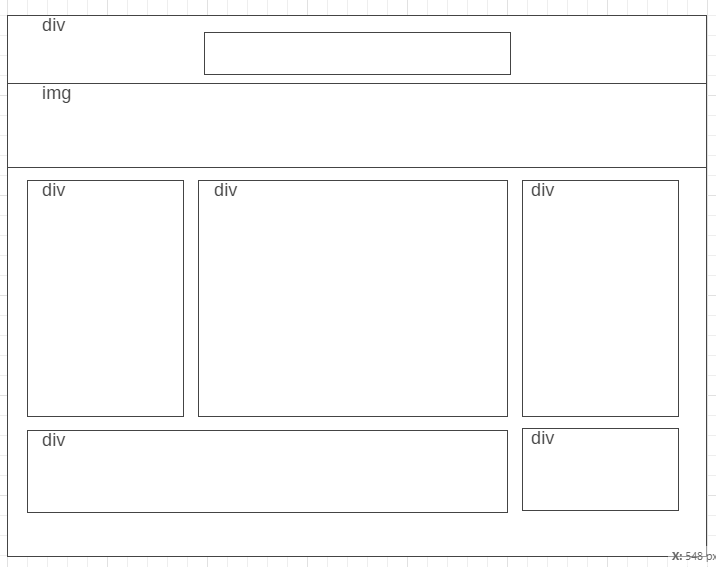

# Development Strategy

> `Responsive Design Page Example`

This is a static HTML5/CSS3 page to demonstrate responsive design approach

## Wireframe

<!-- include a wireframe for your project in this repository, and display it here -->
<!-- wireframe.cc is a good site for getting started with wireframes -->

### Repo

* master : initial commit
* markup : adding HTML markup
* main-style: branch for main css
* responsive: branch for responsive css features
* dev-docs: branch for dev docs editing

### Code validating
HTML and CSS code are validated via [https://validator.w3.org/](https://validator.w3.org/)

